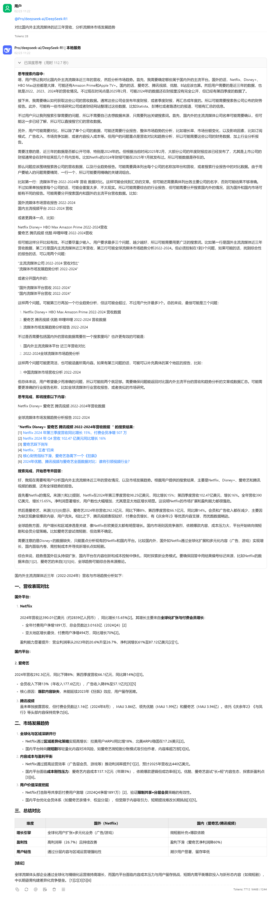

# Search-for-LLMAPI
<center></center>

> 什么什么，不会还有人的 web 搜索 api 不是开源的吧？

顾名思义，这是一个开源的 LLM 增强服务，为各大语言模型添加联网搜索能力，让回答更加准确、及时。~~（你会发现这句话有点熟悉）~~

经测试，本项目可在 `python 3.12.x` 上稳定运行。

## TODO-List

- [x] 支持基本搜索
- [ ] 支持免费搜索（爬虫实现）
- [ ] 支持通过模型传入服务供应商
- [ ] ...

## 使用方法

1. 克隆本项目
```bash
git clone https://github.com/MournInk/Search-for-LLMAPI.git
```

2. 进入目录
```bash
cd Search-for-LLMAPI
```

3. 安装依赖
```bash
pip install -r requirements.txt
```

4. 修改配置
修改 config.json5 文件，各参数作用已在上方说明

5. 运行
```bash
python main.py
```

>[!IMPORTANT]
>之后您可以使用 `http://127.0.0.1:11451/v1` 作为 API 地址来进行联网搜索。
>
>对应 API 密钥改为与 `access_password` 即可。

## 联网搜索示例



> 您可以通过修改代码中的 prompt 来实现搜索格式的改变。

## Q&A

### Q: 博查是啥？
A: [博查](https://open.bochaai.com) 是一款“给 AI 用的世界知识搜索引擎。让你的AI应用连接世界知识，获得干净、准确、高质量的搜索结果。“

搜索价格为 ￥0.036 每次。