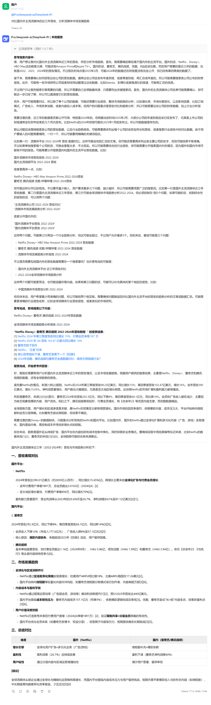

# Search-for-LLMAPI

<center> </center>

> 什么什么，不会还有人的 web 搜索 api 不是开源的吧？

⚠️ **归档通知 / ARCHIVAL NOTICE** ⚠️

该项目已被归档，不再主动维护。原因如下：
- **安全性考虑**：随着AI工具的普及，联网搜索功能可能被滥用
- **成本考虑**：外部API调用成本不断上升
- **维护负担**：项目维护需要大量时间和精力

**迁移建议**：
- 对于个人使用：建议使用现有的AI助手服务（如ChatGPT、Claude等）
- 对于开发者：可参考本项目代码实现自己的解决方案
- 对于企业用户：建议使用专业的AI服务提供商

---

This project has been archived and is no longer actively maintained. Reasons include:
- **Security concerns**: Web search functionality may be misused with the proliferation of AI tools
- **Cost considerations**: Rising costs of external API calls
- **Maintenance burden**: Project maintenance requires significant time and effort

**Migration suggestions**:
- For personal use: Use existing AI assistant services (ChatGPT, Claude, etc.)
- For developers: Reference this project's code to implement your own solution
- For enterprise users: Use professional AI service providers

---

顾名思义，这是一个开源的 LLM 增强服务，为各大语言模型添加联网搜索能力，让回答更加准确、及时。~~（你会发现这句话有点熟悉）~~

经测试，本项目可在 `python 3.12.x` 上稳定运行。

## TODO-List

- [x] 支持基本搜索
- [ ] 支持免费搜索（爬虫实现）
- [ ] 支持通过模型传入服务供应商
- [ ] ...

## 安全和隐私说明 / Security and Privacy

本项目在最后版本中增加了以下安全和隐私改进：

### 安全改进
- ✅ 输入验证和消息长度限制
- ✅ API密钥和访问密码验证
- ✅ 防止恶意URL访问（阻止内网IP）
- ✅ 请求超时和错误处理
- ✅ 默认监听地址改为 127.0.0.1（仅本地访问）
- ✅ 内容长度限制防止资源耗尽

### 隐私设置
- 📝 可配置的日志记录选项
- 🔒 IP地址记录级别控制
- ⚙️ 灵活的隐私配置参数

### 配置建议
1. **强密码**：请在 `config.json5` 中设置强访问密码
2. **本地访问**：建议使用 `127.0.0.1` 而非 `0.0.0.0`
3. **API密钥安全**：妥善保管外部API密钥
4. **定期更新**：关注依赖包的安全更新

## 使用方法

1. 克隆本项目
```bash
git clone https://github.com/MournInk/Search-for-LLMAPI.git
```

2. 进入目录
```bash
cd Search-for-LLMAPI
```

3. 安装依赖
```bash
pip install -r requirements.txt
```

4. 修改配置
修改 config.json5 文件，各参数作用已在文件中说明。**重要配置项**：
- `auth.access_password`: 设置强访问密码
- `server.address`: 建议设为 `127.0.0.1` 仅本地访问
- `api.secret_key` 和 `api.bocha_secret_key`: 配置相应的API密钥
- `limits.*`: 根据需要调整各种限制参数
- `privacy.*`: 根据隐私需求配置日志记录选项

5. 运行
```bash
python main.py
```

>[!IMPORTANT]
>之后您可以使用 `http://127.0.0.1:11451/v1` 作为 API 地址来进行联网搜索。
>
>对应 API 密钥改为与 `access_password` 即可。

## 联网搜索示例



> 您可以通过修改代码中的 prompt 来实现搜索格式的改变。

## Q&A

### Q: 博查是啥？
A: [博查](https://open.bochaai.com) 是一款“给 AI 用的世界知识搜索引擎。让你的AI应用连接世界知识，获得干净、准确、高质量的搜索结果。“

搜索价格为 ￥0.036 每次。